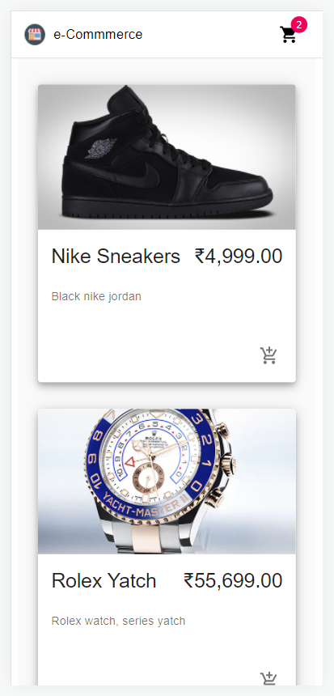
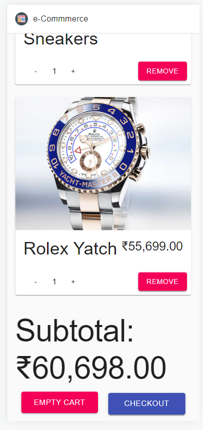
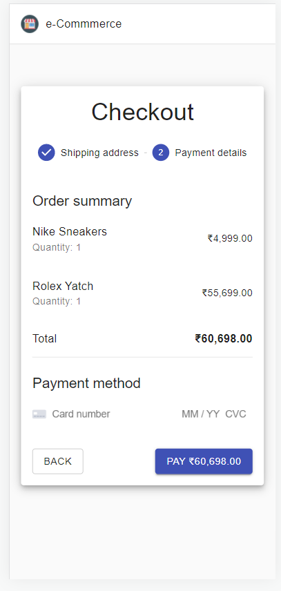
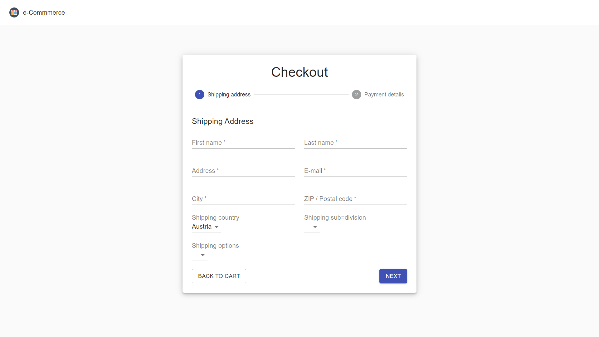

# E-COMMERCE WEBSITE
Using React, commerce-js, stripe and material-ui I have build a e-commerce website. In this app you can select item, add them to cart and also can remove it from cart.

And it is fully Mobile Responsibe.


## Link of the Website
[click here to check the website](https://e-commerce-web-app-five.vercel.app/)


## Screenshots











## Run The Project

Setup:

```bash
    run npm i && npm start the app
```
